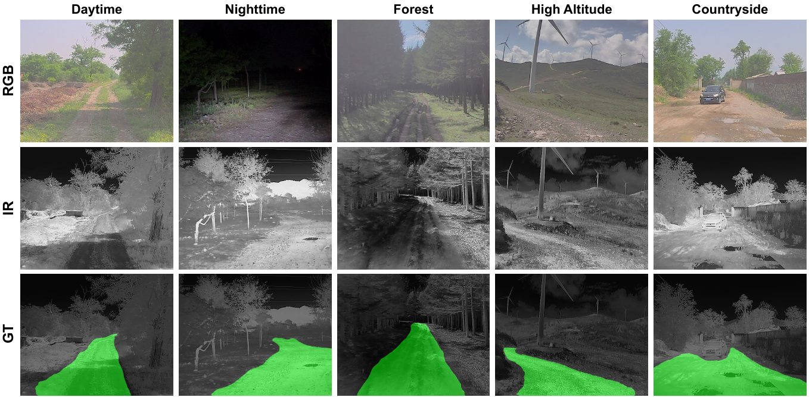

# IRONet: Infrared Off-Road Temporal Freespace Detection

[](https://github.com/wsnbws/IRON)
[](https://github.com/wsnbws/IRON)
[](LICENSE)

> **Towards All-Day Perception for Off-Road Driving: A Large-Scale Multispectral Dataset and Comprehensive Benchmark**
>
> Shuo Wang, Jilin Mei, Wenfei Guan, Shuai Wang, Yan Xing, Chen Min†, Yu Hu†
>
> Institute of Computing Technology, Chinese Academy of Sciences

---

## 📋 Abstract

Off-road nighttime autonomous driving suffers from unreliable visible-light perception, making infrared modality crucial for accurate freespace detection. We present the **IRON dataset** — the first large-scale infrared dataset for off-road temporal freespace detection under all-day conditions — comprising 24,314 densely annotated infrared images with synchronized RGB images. Building on this dataset, we propose **IRONet**, a novel flow-free framework for temporal freespace detection that aggregates historical context via a memory-attention mechanism and a carefully designed mask decoder. IRONet achieves **82.93% IoU** and **90.66% F1** at **32 FPS** on IRON, and generalizes robustly to RGB modalities on ORFD and Rellis-3D.

---

## 🗂️ IRON Dataset

### Overview

The IRON dataset provides the first large-scale infrared video sequences for temporal off-road freespace detection, covering diverse terrains and illumination conditions.

<table>
<tr>
<td>

| Scene | Train | Test | Total |
|-------|------:|-----:|------:|
| 🌾 Countryside | 5,169 | 651 | 5,820 |
| 🌲 Forest | 7,746 | 1,886 | 9,632 |
| 🏔️ High Altitude | 7,107 | 1,755 | 8,862 |
| **Total** | **20,022** | **4,292** | **24,314** |

</td>
<td>

- 📷 **Resolution:** 640×512 (IR) · 1920×1080 (RGB)
- 🌡️ **IR Wavelength:** 8–14 µm (thermal long-wave)
- ⏱️ **Frame Rate:** 2.5 Hz (downsampled from 50 Hz)
- 🎬 **Sequences:** 35 video sequences (27 train / 8 test)
- 🌙 **Light Conditions:** Bright light (13,425) · Low light / Nighttime (10,889)
- 🔗 **Modalities:** Temporally aligned infrared + RGB pairs

</td>
</tr>
</table>

### 🖼️ Dataset Samples

Each column shows a different scene type; rows show the aligned RGB image, infrared image, and freespace annotation respectively.



### ⬇️ Dataset Download

The IRON dataset is available on Baidu Netdisk:

> **Baidu Netdisk:** [https://pan.baidu.com/s/1UYPkj6nHYQRu2SFo7UuwGw?pwd=eiz6](https://pan.baidu.com/s/1UYPkj6nHYQRu2SFo7UuwGw?pwd=eiz6)  （提取码：eiz6）
> **Google Drive(IR&RGB):** .[https://drive.google.com/file/d/1arGIkYy1sTz6O4L29Zp7fZdiXltBWqYJ/view?usp=sharing](https://drive.google.com/file/d/1arGIkYy1sTz6O4L29Zp7fZdiXltBWqYJ/view?usp=sharing)

---

## 🏗️ IRONet Architecture

IRONet is a flow-free temporal segmentation framework consisting of three stages:

1. **Multi-Scale Feature Extraction** — A ConvMAE-pretrained ViT backbone with a PSP-FPN neck extracts multi-scale infrared features `{F_t^i}`.

2. **Memory Attention** — A FIFO memory bank stores mask-aware historical features. Cross-attention with 3D spatiotemporal positional embeddings yields temporally-enriched features `F̃_t`.

3. **Memory Decoder** — A SAM-style decoder with two key innovations:
   - 🔵 **SGMC (Semantic Guided Memory Compensation):** Re-initializes decoder semantics when memory contains no freespace signal (e.g., at sequence start, occlusions, sharp turns).
   - 🟠 **ADT (Alternating Dual-task Training):** Prevents semantic shortcutting by alternating segmentation targets between freespace and background, maintaining strong supervision to temporal modules.

---

## 📈 Results

### IRON Dataset (Infrared Modality)

| Method | Backbone | Prec. (%) | Rec. (%) | F1 (%) | IoU (%) | Params (M) | FPS |
|--------|----------|----------:|--------:|---------:|--------:|-----------:|----:|
| U-Net | — | 71.30 | 90.12 | 79.61 | 66.13 | 31.04 | 21 |
| SegFormer | ViT-S | 82.75 | **92.41** | 87.31 | 77.48 | 27.48 | 33 |
| ROD | ViT-S | 86.12 | 89.06 | 87.56 | 77.88 | 33.43 | 68 |
| DeepLabV3+ | ResNet-101 | 87.25 | 90.31 | 88.75 | 79.78 | 58.75 | 103 |
| Mask2Former | ResNet-50 | 87.80 | 92.22 | 89.95 | 81.74 | 43.95 | 23 |
| ⭐ **IRONet\_3F** | ViT-B | <u>88.15</u> | **93.07** | <u>90.55</u> | <u>82.73</u> | 104.49 | 23 |
| 🏆 **IRONet\_5F** | ViT-S | **90.85** | 90.49 | **90.66** | **82.93** | 40.05 | **32** |

### Generalization to RGB Modalities

<table>
<tr>
<td>

**ORFD Dataset**

| Method | Modality | Prec. | Rec. | F1 | IoU |
|--------|----------|------:|-----:|---:|----:|
| OFF-Net | RGB+LiDAR | 86.6 | 94.3 | 90.3 | 82.3 |
| RoadFormer | RGB+LiDAR | 95.1 | 97.2 | 96.1 | 92.5 |
| ROD† | RGB | 97.9 | 96.3 | 97.1 | 94.3 |
| ⭐ **IRONet\_3F** | RGB | <u>98.0</u> | <u>96.5</u> | <u>97.2</u> | <u>94.6</u> |
| 🏆 **IRONet\_5F** | RGB | **98.0** | **96.7** | **97.3** | **94.8** |

</td>
<td>

**Rellis-3D Dataset**

| Method | Modality | Prec. | Rec. | F1 |
|--------|----------|------:|-----:|---:|
| ROD† | RGB | 94.70 | <u>95.70</u> | 95.20 |
| M2F2-Net | RGB+LiDAR | 92.50 | 96.40 | 94.40 |
| SEO | RGB+LiDAR | 91.64 | 85.08 | 86.22 |
| ⭐ **IRONet\_3F** | RGB | 94.51 | **95.87** | 95.18 |
| 🏆 **IRONet\_5F** | RGB | **95.65** | 95.69 | **95.67** |

</td>
</tr>
</table>

> † Reproduced from official code. **Bold** = best, <u>underline</u> = second best.

---

## 📦 Installation

### Requirements

- Python 3.7+
- PyTorch 1.11+
- CUDA 11.3+
- mmcv-full 1.5.x
- mmsegmentation 0.24.x

### Setup

```bash
# 1. Clone the repository
git clone https://github.com/wsnbws/IRON.git
cd IRON

# 2. Create conda environment
conda create -n ironet python=3.8 -y
conda activate ironet

# 3. Install PyTorch (example: CUDA 11.3)
pip install torch==1.11.0+cu113 torchvision==0.12.0+cu113 -f https://download.pytorch.org/whl/torch_stable.html

# 4. Install mmcv-full
pip install mmcv-full==1.5.0 -f https://download.openmmlab.com/mmcv/dist/cu113/torch1.11.0/index.html

# 5. Install mmsegmentation
pip install mmsegmentation==0.24.0

# 6. Install other dependencies
pip install timm einops scipy
```

---

## ⚖️ Pretrained Weights

Download the ConvMAE pretrained backbone weights:

| Backbone | Pretrain Data | Download |
|----------|--------------|----------|
| ViT-S (ConvMAE) | ImageNet-1K | [convmae_small.pth](https://github.com/Alpha-VL/ConvMAE) |
| ViT-B (ConvMAE) | ImageNet-1K | [convmae_base.pth](https://github.com/Alpha-VL/ConvMAE) |

Place downloaded weights in `./pretrained/`.

---

## 🗃️ Dataset Preparation

### IRON Dataset

```
data/
└── IRON/
    ├── images/
    │   ├── training/
    │   │   ├── seq_001/
    │   │   │   ├── image_000000_*.jpg
    │   │   │   └── ...
    │   │   └── ...
    │   └── testing/
    │       └── ...
    └── annotations/
        ├── training/
        └── testing/
```

Update the dataset root in `configs/_base_/datasets/drivable_video.py`:

```python
data_root = 'data/IRON'
```

### ORFD Dataset

Download from the [official ORFD repository](https://github.com/chaytonmin/Off-Road-Freespace-Detection) and update paths in `configs/_base_/datasets/orfd_video.py`.

### Rellis-3D Dataset

Download from the [official RELLIS-3D repository](https://github.com/unmannedlab/RELLIS-3D) and update paths in `configs/_base_/datasets/rellis_video.py`.

---

## 🚀 Training

### Single GPU

```bash
# IRONet_5F on IRON dataset (best model)
bash train.sh configs/ironet/ironet_vits_iron_5f.py work_dirs/ironet_5f pretrained/convmae_small.pth 1

# IRONet_3F ViT-S on IRON dataset
bash train.sh configs/ironet/ironet_vits_iron_3f.py work_dirs/ironet_3f pretrained/convmae_small.pth 1

# IRONet_3F ViT-B on IRON dataset
bash train.sh configs/ironet/ironet_vitb_iron_3f.py work_dirs/ironet_vitb_3f pretrained/convmae_base.pth 1
```

### Multi-GPU

```bash
# 4-GPU training example
bash train.sh configs/ironet/ironet_vits_iron_5f.py work_dirs/ironet_5f pretrained/convmae_small.pth 4
```

### Generalization to ORFD / Rellis-3D

```bash
# ORFD
bash train.sh configs/ironet/ironet_vits_orfd_5f.py work_dirs/ironet_orfd_5f pretrained/convmae_small.pth 1

# Rellis-3D
bash train.sh configs/ironet/ironet_vits_rellis_5f.py work_dirs/ironet_rellis_5f pretrained/convmae_small.pth 1
```

---

## 🔍 Evaluation

```bash
# Evaluate with visualization output
bash test.sh configs/ironet/ironet_vits_iron_5f.py work_dirs/ironet_5f/checkpoints/best_model.pth results/

# Evaluate metrics only (no visualization)
python custom_test.py configs/ironet/ironet_vits_iron_5f.py work_dirs/ironet_5f/checkpoints/best_model.pth --eval
```

### Distributed Evaluation

```bash
bash tools/dist_test.sh configs/ironet/ironet_vits_iron_5f.py work_dirs/ironet_5f/checkpoints/best_model.pth 4
```

---

## 💾 Model Zoo

Pre-trained IRONet checkpoints will be released upon paper acceptance.

| Config | Dataset | IoU (%) | F1 (%) | FPS | Download |
|--------|---------|--------:|-------:|----:|----------|
| ironet_vits_iron_3f | IRON | 82.73 | 90.55 | 23 | Coming soon |
| ironet_vits_iron_5f | IRON | **82.93** | **90.66** | **32** | Coming soon |
| ironet_vits_orfd_5f | ORFD | 94.8 | 97.3 | 32 | Coming soon |
| ironet_vits_rellis_5f | Rellis-3D | — | 95.67 | 32 | Coming soon |

---

## 📝 Citation

If you find this work useful, please cite:

```bibtex
@article{wang2025iron,
  title={Towards All-Day Perception for Off-Road Driving: A Large-Scale Multispectral Dataset and Comprehensive Benchmark},
  author={Wang, Shuo and Mei, Jilin and Guan, Wenfei and Wang, Shuai and Xing, Yan and Min, Chen and Hu, Yu},
  journal={IEEE Transactions on ...},
  year={2025}
}
```

---

## 🙏 Acknowledgements

This project builds upon [mmsegmentation](https://github.com/open-mmlab/mmsegmentation), [ConvMAE](https://github.com/Alpha-VL/ConvMAE), and [SAM2](https://github.com/facebookresearch/segment-anything-2). We thank the authors for their open-source contributions.

---

## 📜 License

This project is released under the [MIT License](LICENSE).
